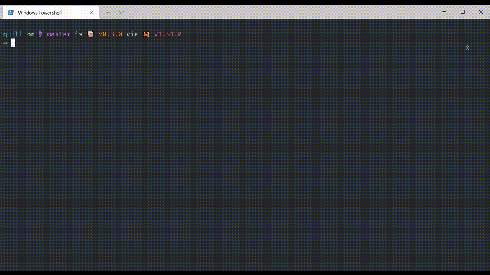

# Quill

Query all your bills and accounts to check on your financial statements.
Check for statements that you've downloaded from your bank, service provider, or other company that issues regular statements.

**NOTE**: This repository has been archived.
Development on this project has been moved to [this repository](https://gitlab.com/jrhawley/quill/).



## Installation

On Windows, Linux, or macOS, install with [Cargo](https://doc.rust-lang.org/cargo/).

```shell
cargo install --git https://github.com/jrhawley/quill.git
```

## Usage

```shell
> quill -h
Query all your bills and accounts to check on your financial statements.

USAGE:
    quill [OPTIONS]

FLAGS:
    -h, --help       Prints help information
    -V, --version    Prints version information

OPTIONS:
    -c, --config <CONF>    The statement configuration file
```

## How it works

See [this blog post](https://jrhawley.github.io/2020/09/19/financial-statements-quill) for details about the motivation and design implementation of Quill.

## Features

### Customized configuration

A configuration file will automatically be loaded from your user's application settings, if one exists.
Quill uses the [`dirs`](https://docs.rs/dirs/latest/dirs/) crate to achieve this, which follows the [expected conventions](https://docs.rs/dirs/latest/dirs/fn.config_dir.html) in each operating system.

| Operating system | Configuration location                                    |
| ---------------- | --------------------------------------------------------- |
| macOS            | `$HOME/Library/Application Support/quill/config.toml`     |
| Linux            | `$HOME/.config/quill/config.toml`                         |
| Windows          | `C:\\Users\\<User>\\AppData\\Roaming\\quill\\config.toml` |

An example configuration file can be found in [`examples/`](examples/config.toml).

### Ignore statements

In the directory for an account whose statements you're checking, you can include a `.quillignore.toml` file with an array of dates and/or file names.
Example ignore files can be found in [`examples/`](examples/).

## Development

### Compilation

Quill is designed to work on Windows, macOS, and Linux operating systems.
To compile binaries for each of these systems, we make use of [`cargo-make`](https://sagiegurari.github.io/cargo-make/).

To build a release version, run:

```shell
# for the OS you're working on
cargo make build-release

# for a specific OS
cargo make build-release-windows
cargo make build-release-macos
cargo make build-release-linux

# for all OS's
cargo make build-release-all
```

To create a tag and a release on GitHub, we make use of the [GitHub CLI](https://cli.github.com/).

```shell
# for the OS you're working on
cargo make release

# for a specific OS
cargo make release-windows
cargo make release-macos
cargo make release-linux

# for all OS's
cargo make release-all
```

### Testing

We generally follow the testing ideas in [The Rust Programming Language Book](https://doc.rust-lang.org/stable/book/ch11-00-testing.html).
To run tests quickly and concisely, we make use of [`cargo-nextest`](https://nexte.st/).

```shell
# run all tests
cargo nextest run
```

